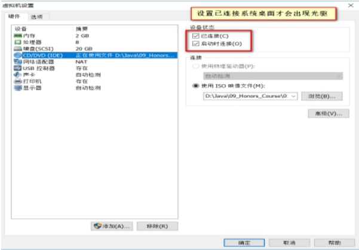

# 第三章 Linux的目录结构

## 学习目标

1 熟悉Linux目录的组织习惯!

2 熟悉一些Linux的常见目录及作用

## 第一节 Linux中的常见目录

> Linux常见的目录结构，不同版本的Linux目录结构可能略有不同

> Centos7的文件目录结构

> Linux根目录下的常见目录及作用

1\. /bin：★(/usr/bin,/usr/local/bin)

是Binary的缩写, 这个目录存放着最经常使用的命令,Linux默认的环境变量已经包含该路径,所以可以直接使用该路径下的指令如 cd指令&#x20;

可以通过echo \$PATH查看系统环境变量来看是否包含了该目录

2\. /sbin：(/usr/sbin, /usr/local/sbin)

s就是Super User的意思，这里存放的是系统管理员使用的系统管理程序。

以上目录，任何命令在任意目录下都可执行命令

3\. /home：★

存放普通用户的主目录，在Linux中每个用户都有一个自己的目录，一般该目录名是以用户的账号命名的。

4\. /root：★

该目录为系统管理员，也称作超级权限者的用户主目录。

5\. /lib：

系统开机所需要最基本的动态连接共享库，其作用类似于Windows里的DLL文件。几乎所有的应用程序都需要用到这些共享库。

6\. /lost+found：

这个目录一般情况下是空的，当系统非法关机后，这里就存放了一些文件。

7\. /etc：★

所有的系统管理所需要的配置文件和子目录。my.cnf

8\. /usr：★&#x20;

这是一个非常重要的目录，用户的很多应用程序和文件都放在这个目录下，类似与windows下的program files目录。

9\. /boot：★

这里存放的是启动Linux时使用的一些核心文件，包括一些连接文件以及镜像文件，自己的安装别放这里&#x20;

10\. /proc：

这个目录是一个虚拟的目录，它是系统内存的映射，我们可以通过直接访问这个目录来获取系统信息。

11\. /srv：

service缩写，该目录存放一些服务启动之后需要提取的数据。

12\.    /sys：&#x20;

这是linux2.6内核的一个很大的变化。该目录下安装了2.6内核中新出现的一个文件系统 sysfs 。（内核）

13\.    /tmp：

这个目录是用来存放一些临时文件的。

14\.    /dev：★

Device(设备)的缩写,类似windows的设备管理器，把所有的硬件用文件的形式存储。&#x20;

15\.    /media：★

linux系统会自动识别一些设备，例如U盘、光驱等等，当识别后，linux会把识别的设备挂载到这个目录下。CentOS6 就在/media下,CentOS7换目录了/

16\.    /mnt：★

系统提供该目录是为了让用户临时挂载别的文件系统的，我们可以将光驱挂载在/mnt/上，然后进入该目录就可以查看光驱里的内容了。

17\.    /opt：★

这是给主机额外安装软件所摆放的目录。

比如你安装JDK、Tomcat则就可以放到这个目录下。默认是空的。

18\.    /usr/local: ★

这是另一个给主机额外安装软件所摆放的目录.一般是通过编译源码方式安装的程序。

19\.    /var：★

这个目录中存放着在不断扩充着的东西，我们习惯将那些经常被修改的目录放在这个目录下。包括各种日志文件。
